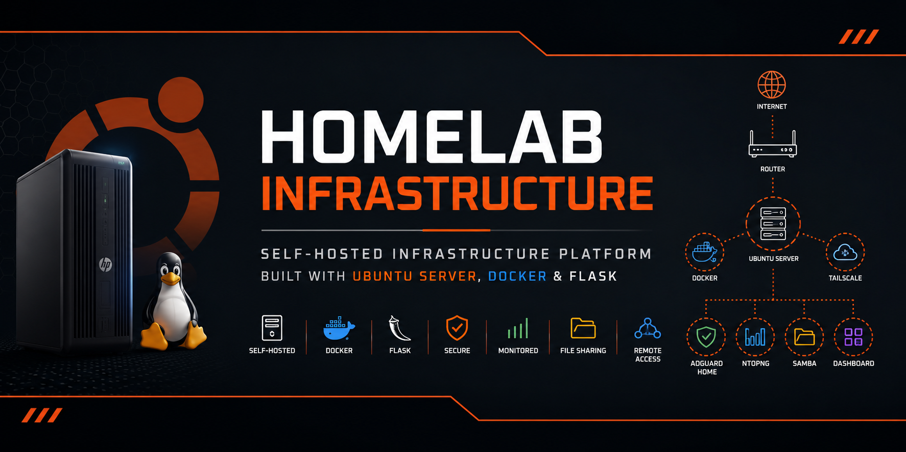
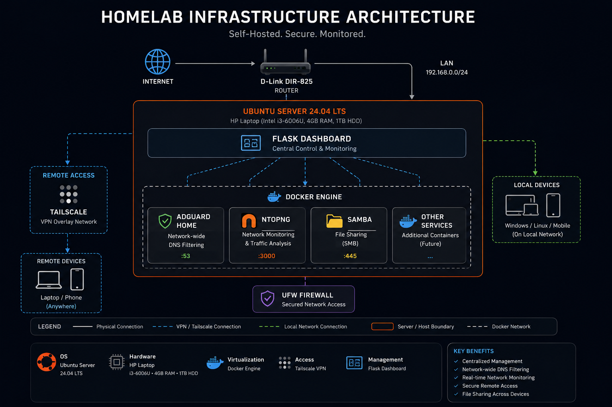

<p align="center">
  
</p>

# Homelab Infrastructure

A self-hosted infrastructure project built on an old HP laptop running Ubuntu Server 24.04 LTS. The project focuses on building a lightweight, secure, and fully documented homelab using open-source technologies while serving as a platform for learning Linux administration, networking, Docker, and self-hosting.

Rather than relying on an off-the-shelf management interface, this project is centered around a custom Flask dashboard that provides centralized access to infrastructure services and system information.

---

## Preview

The homelab is managed through a custom Flask dashboard that provides centralized access to infrastructure services, system information, and network tools.

> Dashboard screenshots will be added as the project evolves.

## Overview

The current platform consists of the following core components:

- Ubuntu Server 24.04 LTS
- Docker
- Custom Flask Dashboard
- AdGuard Home
- ntopng
- Samba
- Tailscale
- UFW Firewall

---

## Hardware

| Component | Specification |
|-----------|---------------|
| Device | HP Laptop |
| CPU | Intel Core i3-6006U |
| Memory | 4 GB DDR4 |
| Storage | 1 TB HDD |
| Operating System | Ubuntu Server 24.04 LTS |

---

## Features

- Custom web-based infrastructure dashboard built with Flask
- Network-wide DNS filtering using AdGuard Home
- Real-time network traffic monitoring with ntopng
- Secure remote access using Tailscale VPN
- SMB file sharing across Windows and Linux devices
- Docker-first service deployment
- Firewall protection using UFW
- Modular documentation for every deployed service
- Clean repository structure designed for maintainability

---

## Technology Stack

| Category | Technologies |
|----------|--------------|
| Operating System | Ubuntu Server 24.04 LTS |
| Containers | Docker |
| Backend | Python, Flask |
| Networking | AdGuard Home, Tailscale |
| Monitoring | ntopng |
| File Sharing | Samba |
| Security | UFW |

## Architecture

The diagram below illustrates the current infrastructure, networking topology, and service relationships within the homelab.

<p align="center">
    
</p>

## Project Structure

```text
homelab-infrastructure/
│
├── assets/
├── diagrams/
├── docker/
├── docs/
├── screenshots/
├── scripts/
└── README.md
```

---

## Documentation

Documentation for every deployed service is available inside the `docs/` directory.

| Document | Purpose |
|----------|---------|
| ubuntu.md | Ubuntu Server installation |
| docker.md | Docker configuration |
| dashboard.md | Flask dashboard |
| adguard-home.md | DNS filtering |
| ntopng.md | Network monitoring |
| samba.md | SMB shares |
| tailscale.md | Remote access |
| ufw.md | Firewall |
| networking.md | Network topology |

---

## Roadmap

- [ ] Nginx Reverse Proxy
- [ ] HTTPS / SSL
- [ ] Grafana
- [ ] Prometheus
- [ ] CrowdSec
- [ ] Wazuh
- [ ] Automated Backups

---

## License

This project is licensed under the MIT License.
