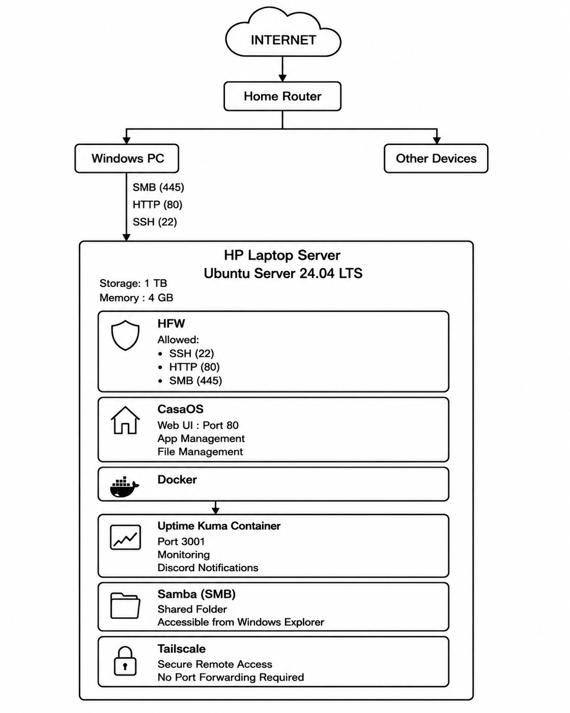

# HomeLab Infrastructure

A self-hosted home server built using an old HP laptop running Ubuntu Server 24.04 LTS.

## Current Stack

- Ubuntu Server 24.04 LTS
- CasaOS
- Docker
- Samba (SMB)
- Tailscale
- UFW Firewall
- Uptime Kuma
- Discord Notifications

## Hardware

| Component | Specification |
|------------|------------|
| Device | HP Laptop |
| Storage | 1 TB |
| Memory | 4 GB RAM |
| OS | Ubuntu Server 24.04 LTS |

## Features

- Network file sharing
- Secure remote access via Tailscale
- Firewall protection using UFW
- Docker container management
- Monitoring with Uptime Kuma
- Discord alerting

## Architecture

- Monitoring
- VPNs
- Security Hardening
